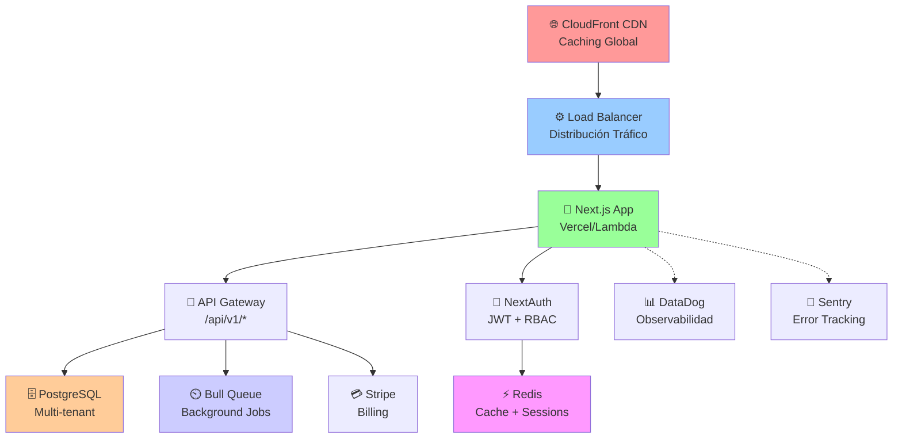

# 🚀 ESTRATEGIA SAAS ENTERPRISE: DE CONCESIONARIA A STARTUP TECNOLÓGICA

## 📋 ÍNDICE EJECUTIVO
1. [Visión y Propuesta de Valor](#visión-y-propuesta-de-valor)
2. [Arquitectura Tecnológica Escalable](#arquitectura-tecnológica-escalable)
3. [Estrategia Multi-Tenant](#estrategia-multi-tenant-profesional)
4. [Roadmap Técnico por Fases](#roadmap-técnico-3-fases)
5. [Modelo SaaS y Monetización](#modelo-saas-y-monetización)
6. [Métricas para Inversores](#métricas-clave-para-inversores)
7. [Seguridad a Nivel Enterprise](#seguridad-a-nivel-enterprise)
8. [Estrategia de Producto](#estrategia-de-producto)
9. [Plan de Migración](#plan-de-migración-desde-sistema-actual)
10. [Análisis de Riesgos](#análisis-de-riesgos-empresariales)

---

## 🎯 VISIÓN Y PROPUESTA DE VALOR

### Posicionamiento de Mercado
```
NOMBRE: AutoHub (o similar - "ERP Moderno para Concesionarias")
SLOGAN: "La plataforma SaaS inteligente para concesionarias de América Latina"
```

### Propuesta de Valor vs Competencia
| Característica | ERPs Tradicionales | Otras Plataformas | AutoHub SaaS |
|---|---|---|---|
| **Modelo** | Licencia perpetua ($50K-200K) | SaaS básico | SaaS escalable |
| **Implementación** | 6-12 meses | 4-8 semanas | 2 semanas |
| **Costo Inicial** | Alto capex | Moderado | Bajo (freemium posible) |
| **Escalabilidad** | Limitada | Media | Horizontal (sin límite) |
| **Integraciones** | Limitadas | API basic | APIs modernas + webhooks |
| **IA/Analytics** | No | Parcial | Hoja de ruta clara |
| **Multi-sucursal** | Extra fee | Nativo | Nativo sin extra |
| **Actualizaciones** | Anuales | Mensuales | Diarias |
| **Mobile** | Legacy | Web responsivo | Native + PWA |
| **Precio/Mes** | N/A | $500-2000 | $99-499 |

### Ventajas Competitivas
1. **Diseño pensado para el sector** - No es un ERP genérico
2. **Velocidad de implementación** - Curva de aprendizaje corta
3. **Actualizaciones continuas** - Evoluciona con necesidades del mercado
4. **Ecosistema integrado** - Lead tracking + Inventario + Facturación sin add-ons
5. **Precio transparente y escalable** - No hay sorpresas
6. **Soporte en español nativo** - Ventaja regional

---

## 🏗️ ARQUITECTURA TECNOLÓGICA ESCALABLE

### 1. DECISIÓN: MONOLITO MODULAR vs MICROSERVICIOS

#### Análisis Comparativo

**OPCIÓN A: Monolito Modular (RECOMENDADO Fase 1-2)**
```
├── API Gateway (Next.js)
├── Módulo CRM
├── Módulo Inventario
├── Módulo Facturación
├── Módulo Reportes
├── Módulo Usuarios & RBAC
├── Módulo Integraciones
└── Capa de Datos (Prisma + PostgreSQL)

Ventajas:
✅ Desarrollo rápido (1-2 meses MVP)
✅ Debugging simple
✅ Deployar una sola aplicación
✅ Compartir código/utilities
✅ Transacciones ACID nativas
✅ Single database schema
✅ Costo hosting mínimo (~$50/mes inicio)
✅ Fácil de vender a inversores (demostración clara)

Desventajas:
⚠️ Escalabilidad horizontal limitada (compilación monolítica)
⚠️ Un error puede derribar todo
⚠️ Difícil separar ownership de features

Costos Estimados:
- Desarrollo: 12-16 semanas (1 dev senior + 1 junior)
- Hosting: Vercel Pro ($20) + BD (Neon $0-50)
- Total fase 1: $5-8K
```

**OPCIÓN B: Microservicios desde el inicio (NO RECOMENDADO)**
```
❌ Prematura optimización
❌ Complejidad innecesaria
❌ Aumenta costo de desarrollo 3x
❌ Deploying, testing, debugging más difícil
❌ Ideal para después de $1M ARR
```

**OPCIÓN C: Monolito → Microservicios Progresivo (HYBRID - RECOMENDADO)**
```
Fase 1 (MVP): Monolito modular
Fase 2 (Growth): Extraer módulos grandes como microservicios si necesario
Fase 3 (Scale): Arquitectura full microservicios con mensajería

Ventajas:
✅ Lo mejor de ambos mundos
✅ No sobre-engineering inicial
✅ Preparado para escalar sin rehacer
✅ Menor riesgo de fracaso
```

### 2. STACK TECNOLÓGICO RECOMENDADO

#### Backend & API
```typescript
// Versiones recomendadas
"next": "^16.2.4",           // App Router, API Routes, Edge Functions
"prisma": "^5.0.0",          // ORM (mantener actual)
"postgresql": "16",           // Base de datos
"nextauth": "^5.0.0",        // Auth (actualizar a v5)
"zod": "^3.24.0",            // Validación
"next-rate-limit": "^1.0.0", // Rate limiting
"sentry": "^8.0.0",          // Error tracking
"axios": "^1.7.0",           // HTTP client
"stripe": "^17.0.0",         // Pagos (cuando monetizar)
"bull": "^4.14.0",           // Job queue (background jobs)
"redis": "^4.7.0",           // Cache + Bull backend
"pino": "^9.2.0",            // Logging estructurado
```

#### Frontend
```typescript
"react": "^19.2.4",
"next": "^16.2.4",
"typescript": "^5",
"tailwindcss": "^3.3.0",
"shadcn/ui": "^0.8.0",       // Actualizar componentes
"react-hook-form": "^7.52.0",
"zustand": "^4.5.0",         // State management (mejor que props drilling)
"tanstack/react-query": "^5.28.0", // Data fetching (NUEVO)
"recharts": "^2.12.0",       // Charts para reportes
"lucide-react": "^0.400.0"
```

#### DevOps & Deployment
```
Fase 1 (MVP):
- Vercel (Free/Pro) - Frontend + API serverless
- Neon (Serverless PostgreSQL) - $0-100/mes
- GitHub Actions - CI/CD gratis
- Sentry - Error tracking ($29/mes)

Fase 2 (Growth):
+ Redis Cloud - $7/mes (2.5GB)
+ Bull Dashboard - Local monitoring
+ DataDog - $15/mes (observabilidad)
+ New Relic - APM (alternativa)

Fase 3 (Scale):
+ AWS RDS + Read Replicas
+ AWS Lambda + API Gateway
+ CloudFront CDN - Distribución global
+ DynamoDB - Para lectura de reportes
```

### 3. ARQUITECTURA: DIAGRAMA CONCEPTUAL



### 4. PATRONES ARQUITECTÓNICOS

#### A. Modularización por Dominio (Domain-Driven Design)
```typescript
app/
├── api/
│   ├── v1/
│   │   ├── leads/
│   │   │   ├── route.ts          (CRUD base)
│   │   │   ├── [id]/
│   │   │   │   ├── route.ts      (GET individual)
│   │   │   │   ├── activities/
│   │   │   │   │   └── route.ts  (Auditoría)
│   │   │   │   └── tasks/
│   │   │   │       └── route.ts  (Tareas)
│   │   │   └── bulk-actions/
│   │   │       └── route.ts      (Operaciones masivas)
│   │   ├── units/
│   │   ├── deals/
│   │   ├── users/
│   │   ├── reports/
│   │   └── integrations/
│   └── middleware/
│       ├── auth.ts
│       ├── tenant.ts
│       ├── rate-limit.ts
│       └── logging.ts
├── lib/
│   ├── domains/
│   │   ├── leads/
│   │   │   ├── service.ts        (Lógica negocio)
│   │   │   ├── repository.ts     (Data access)
│   │   │   ├── dto.ts            (Validación)
│   │   │   └── events.ts         (Domain events)
│   │   ├── units/
│   │   ├── deals/
│   │   └── ...
│   ├── shared/
│   │   ├── auth.ts
│   │   ├── tenant.ts
│   │   ├── prisma.ts
│   │   ├── errors.ts
│   │   └── utils.ts
│   └── infrastructure/
│       ├── redis.ts
│       ├── jobs.ts
│       ├── mailer.ts
│       └── sentry.ts
└── prisma/
    └── schema.prisma             (Única fuente de verdad)
```

#### B. Event-Driven Architecture (Preparado para Escalabilidad)
```typescript
// Ejemplos de eventos que desencadenan acciones
interface DomainEvent {
  type: 'leads.created' | 'deal.closed' | 'unit.sold' | 'payment.received'
  tenantId: string
  data: any
  timestamp: Date
  version: number
}

// Handlers (pueden ser síncronos al principio, asíncronos después)
const eventHandlers = {
  'deal.closed': [
    sendNotificationToBuyer(),      // Email
    createInvoice(),                // Facturación
    updateInventory(),              // Stock
    recordMetric(),                 // Analytics
    sendWhatsAppTemplate(),         // WhatsApp
  ]
}

// Beneficio: Cuando escales a microservicios, cambias el publisher
// de "en-memoria" a "RabbitMQ/SQS" sin cambiar handlers
```

#### C. API Versionada y Evolutiva
```
/api/v1/                        - Versión actual estable
/api/v2/                        - En desarrollo (no público)
/api/internal/                  - Uso interno solamente
/api/webhooks/                  - Eventos incoming
/api/integrations/              - Para partners
```

---

## 🏢 ESTRATEGIA MULTI-TENANT PROFESIONAL

### 1. MODELOS DISPONIBLES

#### **Opción A: Tenant Logic Only (Base de datos compartida)**
```sql
CREATE TABLE companies (
  id UUID PRIMARY KEY,
  name VARCHAR(255) NOT NULL,
  slug VARCHAR(100) UNIQUE NOT NULL,
  customDomain VARCHAR(255) UNIQUE,
  planId UUID NOT NULL,
  status ENUM ('TRIAL', 'ACTIVE', 'SUSPENDED', 'CANCELLED'),
  metadata JSONB,
  createdAt TIMESTAMP,
  deletedAt TIMESTAMP
);

CREATE TABLE users (
  id UUID PRIMARY KEY,
  email VARCHAR(255) NOT NULL,
  companyId UUID NOT NULL REFERENCES companies(id),
  role ENUM ('ADMIN', 'MANAGER', 'SELLER', 'VIEWER'),
  permissions JSONB,
  createdAt TIMESTAMP,
  deletedAt TIMESTAMP,
  UNIQUE(companyId, email)
);

-- Todos los datos compartidos una DB, filtrados por companyId
CREATE TABLE leads (
  id UUID PRIMARY KEY,
  companyId UUID NOT NULL REFERENCES companies(id),
  -- ... resto de campos
  INDEX (companyId, status)
);

Ventajas:
✅ Costo operativo mínimo (~$50/mes BD inicial)
✅ Implementación rápida
✅ Migraciones simples (una DB)
✅ Backups centralizados
✅ Ideal para MVP/Growth

Desventajas:
⚠️ Noisy neighbor problem (un cliente lento afecta a otros)
⚠️ Compliance difícil (datos geográficamente dispersos)
⚠️ Escalabilidad limitada (~10K tenants máximo)
⚠️ Problemas de performance cuando DB crece

Cuándo usar: MVP → 1M ARR
```

#### **Opción B: Schema per Tenant (Por esquema)**
```sql
-- Crear esquema por tenant en misma BD
CREATE SCHEMA customer_001;
CREATE SCHEMA customer_002;

CREATE TABLE customer_001.leads (
  id UUID PRIMARY KEY,
  -- ... mismo schema pero datos aislados
);

-- En queries: 
SELECT * FROM ${schemaId}.leads WHERE status = 'NEW';

Ventajas:
✅ Aislamiento mejor que Opción A
✅ Mejor performance (esquemas separados)
✅ Migraciones por tenant posibles
✅ Compliance más fácil
✅ Escalable a ~100K tenants

Desventajas:
⚠️ Más complejo de administrar
⚠️ Backups/restore por schema
⚠️ Aún comparten recursos BD

Cuándo usar: Growth → 5M ARR (si necesitas mejor aislamiento)
```

#### **Opción C: Database per Tenant (Máximo aislamiento)**
```sql
-- Una BD por customer (en RDS Aurora Multi-Master, o separadas)
customer_001_db: postgresql://...
customer_002_db: postgresql://...
customer_003_db: postgresql://...

-- Router middleware resuelve correcta BD por tenant
const dbConnection = getTenantDatabase(req.session.tenantId);
const leads = await dbConnection.lead.findMany();

Ventajas:
✅ Máximo aislamiento (compliance, seguridad)
✅ Escalabilidad casi ilimitada
✅ Cada tenant puede tener su backup/SLA
✅ Compliance GDPR/regulatorio más fácil
✅ Migraciones por tenant sin afectar otros

Desventajas:
❌ Costo operativo alto ($50-200 por BD)
❌ Complejidad operacional (manejar N conexiones)
❌ Migraciones schema requieren ejecutar N veces
❌ Análisis cross-tenant requiere especial cuidado

Cuándo usar: Scale → 10M+ ARR + Cumplimiento regulatorio
```

### 2. RECOMENDACIÓN PARA TU CASO

| Fase | Modelo | Justificación | Costo | Tenants |
|------|--------|---------------|-------|---------|
| **MVP (Meses 1-3)** | Opción A | Rápido, barato, suficiente | $50/mes | 0-50 |
| **Growth (Meses 4-12)** | Opción A mejorada | Scale sin cambios DB | $200/mes | 50-500 |
| **Scale (Año 2)** | Opción A → B | Si performance degrada | $500/mes | 500+ |
| **Enterprise (Año 3+)** | Opción B/C | Clientes grandes requieren aislamiento | $1000+/mes | 10K+ |

### 3. IMPLEMENTACIÓN RECOMENDADA (Opción A Mejorada)

```typescript
// lib/tenant.ts - Aislamiento automático
import { getServerSession } from "next-auth"

export async function getTenantId() {
  const session = await getServerSession();
  if (!session?.user?.companyId) throw new Error('Unauthorized');
  return session.user.companyId;
}

// lib/prisma.ts - Wrapper que añade filtro automático
const prisma = new PrismaClient();

export const db = {
  lead: {
    async findMany(where = {}) {
      const tenantId = await getTenantId();
      return prisma.lead.findMany({
        where: { ...where, companyId: tenantId }
      });
    },
    // ... resto de operaciones con filtro automático
  },
  // ... copiar patrón para todas las entidades
}

// En API routes:
export async function GET(req: Request) {
  const leads = await db.lead.findMany({ status: 'NEW' });
  // ✅ Automáticamente filtra por tenant actual
}

// Ventajas:
// ✅ No necesitas escribir WHERE companyId cada vez
// ✅ Imposible filtrar otro tenant (seguridad por diseño)
// ✅ Fácil migrar a Opción B después (cambiar getTenantId)
```

---

## 📊 ROADMAP TÉCNICO: 3 FASES

### FASE 1: MVP COMERCIAL (Semanas 1-12)

**Objetivo**: Producto mínimo viable, vendible, sin deuda técnica crítica

**Duración**: 12 semanas (3 meses)  
**Equipo**: 1 Full-Stack Senior + 1 Junior (puede ser solo senior si es urgente)  
**Costo**: $5-8K desarrollo + $1-2K hosting/herramientas  
**Resultado**: Producto en producción, primeros clientes, ready para inversión

#### **Semana 1-2: Refactor de Seguridad**
```
✓ Audit logging en todas las operaciones
  - Nueva tabla: AuditLog (userId, action, resource, before, after)
  - Middleware que log todos los POST/PATCH/DELETE

✓ RBAC granular (reemplazar 3 roles simples)
  - Nueva tabla: Role con permisos granulares
  - Nueva tabla: RolePermission (role ↔ permission)
  - Permisos: "leads.view", "leads.create", "deals.approve", etc.
  - Middleware de autorización por permiso

✓ Rate limiting
  - next-rate-limit en todos los endpoints
  - Límites: 60 req/min por IP, 1000 req/día por API key

✓ Secrets management
  - Mover todos los secrets a .env.local
  - Usar Vercel Environment Variables
  - Remover docker-compose.yml o usar .env.example

✓ Input sanitization
  - Sanitizar strings (DOMPurify)
  - SQL injection checks (Prisma ya protege)
  - XSS protection (Content-Security-Policy headers)

✓ CORS configuración
  - Restringir a dominios autorizados
  - Only allow credentials: same-origin
```

#### **Semana 3-4: Escalabilidad Base**
```
✓ Paginación en todos los GET
  - TanStack Table tiene built-in
  - Implementar LIMIT/OFFSET
  - Mantener current: cursor-based pagination (más eficiente)

✓ Caching inteligente
  - Redis Cloud (free tier)
  - ISR (Incremental Static Regeneration) en páginas públicas
  - Cache HTTP headers apropiados

✓ Background jobs (Bull)
  - Mover WhatsApp sends a queue
  - Email queuing
  - Report generation asincrónico

✓ Full-text search básico
  - PostgreSQL FTS (built-in)
  - Búsqueda en leads: nombre, teléfono, email
  - Búsqueda en units: marca, modelo, año

✓ Database optimization
  - Analizar queries lentas con EXPLAIN
  - Optimizar índices
  - Connection pooling (Prisma Accelerate)
```

#### **Semana 5-6: Observabilidad**
```
✓ Logging estructurado
  - Reemplazar console.log con Pino
  - Logs a stdout (Vercel captura)
  - Estrutura: { timestamp, level, message, context, userId, tenantId }

✓ Error tracking (Sentry)
  - Integración Next.js
  - Captura unhandled exceptions
  - Source maps para debugging
  - Alertas en Slack

✓ Métricas básicas
  - Request count
  - Response time
  - Error rate
  - DB query time

✓ Monitoring dashboard
  - Vercel Analytics (built-in)
  - PostHog para eventos de usuario (gratis)
  - Custom dashboards
```

#### **Semana 7-8: Features MVP**
```
✓ Modelo de datos completado
  - Agregar campos faltantes (metadata, notas)
  - Campos de auditoría (createdAt, updatedAt, createdBy)
  - Soft deletes consistentes

✓ Dashboard mejorado
  - KPIs principales: Leads month, Deals closed, Revenue
  - Gráficos simples (Recharts)
  - Filtros por fecha/estado

✓ Gestión de usuarios
  - Invitar usuarios a company
  - Cambiar rol/permisos
  - Desactivar usuario (soft delete)

✓ Validaciones reforzadas
  - Email verification (link en email)
  - Phone verification (SMS otp)
  - Company setup wizard

✓ Configuración por tenant
  - Company branding (logo, colores)
  - Preferencias (moneda, timezone, idioma)
  - Plantillas de WhatsApp personalizadas
```

#### **Semana 9-10: Testing & QA**
```
✓ E2E tests críticos
  - Login → Create Lead → Convert to Deal → Complete
  - User management (invite, change role)
  - Datos multi-tenant aislados

✓ Unit tests API
  - Servicios principales (80% coverage objetivo)
  - Validaciones Zod
  - Errors handling

✓ Load testing
  - Simular 100+ usuarios concurrentes
  - Identificar bottlenecks
  - Ajustar límites

✓ Penetration testing básico
  - OWASP Top 10 checks
  - SQL injection attempts
  - CSRF token verification
```

#### **Semana 11-12: Deployment & Launch**
```
✓ Producción hardening
  - SSL/TLS certificados (Vercel automático)
  - Security headers (Helmet en Next.js)
  - Rate limiting en producción
  - Backups automáticos (BD)

✓ Documentación
  - API docs (Swagger/OpenAPI)
  - Setup guide para customers
  - Admin manual

✓ Onboarding customers
  - Crear primeros 5 clientes beta
  - Feedback loop
  - Training webinars

✓ Metrics setup
  - MRR tracking
  - Churn monitoring
  - Feature usage analytics

✓ Launch
  - Anuncio en redes
  - Outreach a concesionarios
  - Freemium trial (30 días)
```

**Deliverables Fase 1:**
- ✅ App en producción (Vercel)
- ✅ 5-10 clientes en trial
- ✅ Auditoría de seguridad pasada
- ✅ Documentación técnica
- ✅ Primeras métricas SaaS (MRR ~$500-1000)
- ✅ Presentación para inversores (MVP validado)

**Costo aproximado Fase 1:**
```
Desarrollo:       $6,000 (1 senior + 1 junior, 12 semanas)
Hosting:          $150 (Vercel Pro + Neon)
Herramientas:     $300 (Sentry, Redis, domains)
Total:            ~$6,450
```

---

### FASE 2: GROWTH (Semanas 13-36)

**Objetivo**: Validación de mercado, crecimiento a múltiples tenants, optimizaciones

**Duración**: 24 semanas (6 meses)  
**Equipo**: 2-3 Full-Stack + 1 Mobile (opcional)  
**Costo**: $20-30K desarrollo + $2-5K ops  

#### **Semana 13-15: Performance & Infrastructure**
```
✓ Database sharding preparación
  - Estudiar migración futura a multi-BD (Opción B)
  - Implementar tenant routing layer

✓ Read replicas
  - PostgreSQL read-only replicas en Neon
  - Reportes pesados contra read replicas
  - Transactions contra primary

✓ CDN y assets estáticos
  - Vercel Edge Network (automático)
  - WebP images con next/image
  - Font optimization

✓ API optimization
  - GraphQL evaluation (vs REST)
  - Request batching
  - Lazy loading de relaciones

✓ Frontend performance
  - Code splitting automático (Next.js)
  - Lighthouse > 90
  - CLS < 0.1 (Core Web Vitals)
```

#### **Semana 16-20: Integraciones & Extensibilidad**
```
✓ API pública con webhooks
  - Documentación OpenAPI/Swagger
  - API keys por tenant
  - Webhook signing (HMAC)
  - Eventos: lead.created, deal.closed, payment.received

✓ Integraciones prioritarias
  - WhatsApp Business API (no template demo)
  - Email provider (SendGrid/Resend)
  - SMS provider (Twilio)
  - Google Calendar (para tareas)

✓ Plugin system (future-proofing)
  - Arquitectura preparada para extensiones
  - Custom fields dinámicos
  - Webhooks configurables por UI

✓ Zapier/Make.com integrations
  - Conecta a 5000+ aplicaciones
  - Lead automation workflows
  - Notificaciones a Slack/Teams
```

#### **Semana 21-24: Analytics & Reporting**
```
✓ Reportes avanzados
  - Ventas por mes/usuario/categoría
  - Conversión: Lead → Deal → Paid
  - Ticket promedio, CAC, LTV por segmento
  - Inventory rotation analysis

✓ Custom dashboards por rol
  - Admin: Overall metrics
  - Manager: Team performance
  - Seller: Personal pipeline

✓ Export & scheduling
  - PDF reports automáticos
  - Email scheduling
  - Integración con Google Sheets

✓ BI layer (opcional pero recomendado)
  - Vercel Analytics + PostHog
  - Considerar: Metabase/Superset self-hosted
```

#### **Semana 25-28: Mobile & UX**
```
✓ Mobile optimization
  - Diseño responsivo mejorado
  - PWA (Progressive Web App) para offline
  - Push notifications

✓ Native mobile (opcional)
  - React Native/Expo para iOS/Android
  - Sincronización automática
  - Soporte offline

✓ UX improvements
  - Rediseño completo del dashboard
  - Onboarding interactivo
  - Keyboard shortcuts
  - Dark mode (si demanda existe)
```

#### **Semana 29-32: Escalabilidad Horizontal**
```
✓ Kubernetes preparación (si crecimiento justifica)
  - Containerizar aplicación
  - Helm charts
  - Auto-scaling basado en métricas

✓ Alternativa: Serverless (recomendado)
  - AWS Lambda si supera límites Vercel
  - Mantener Edge Functions en Vercel CDN

✓ Multi-región deployment
  - Replicar infra a 2-3 regiones (ej: US-East, EU, LATAM)
  - Latencia < 100ms para usuarios

✓ Disaster recovery
  - RTO: 1 hora (máximo tiempo sin servicio)
  - RPO: 15 min (máximo datos perdidos)
  - Backups automáticos en 3 regiones
```

#### **Semana 33-36: Preparación para inversión**
```
✓ Financials & cap table
  - Proyecciones 3-5 años
  - Unit economics claros
  - Runway estimation

✓ Legal & compliance
  - ToS y Privacy Policy
  - DPA (Data Processing Agreement)
  - GDPR compliance documentation
  - SOC 2 Type II iniciado

✓ Presentación a inversores
  - Pitch deck actualizado
  - Números reales (MRR, churn, LTV)
  - Clientes pagantes como case studies
  - Roadmap 18 meses

✓ Organización
  - Documentación técnica y operacional
  - Runbooks para ops
  - Knowledge base para customers
```

**Deliverables Fase 2:**
- ✅ 50-100 clientes pagantes
- ✅ MRR $5-10K
- ✅ API pública con partners integrando
- ✅ Mobile app (PWA mínimo)
- ✅ Documentación completa
- ✅ Pitch deck listo para inversión
- ✅ SOC 2 Type II en progreso

**Costo aproximado Fase 2:**
```
Desarrollo:       $25,000 (2-3 devs, 6 meses)
Infraestructura:  $4,000 (BD replicas, multi-región, herramientas)
Compliance:       $3,000 (legal review, SOC 2 audit)
Total:            ~$32,000
```

---

### FASE 3: SCALE & INTERNACIONALIZACIÓN (Meses 7-24)

**Objetivo**: Preparación empresarial, expansión internacional, límites de escalabilidad vertical resueltos

**Duración**: 18 meses  
**Equipo**: 5-8 devs + DevOps + Product Manager  
**Costo**: $80-150K desarrollo + $15-30K ops  

#### **Trimestre 1 (Meses 7-9): Microservicios Selectivos**
```
✓ Event-driven architecture (Kafka/RabbitMQ)
  - Desacoplar módulos principales
  - Eventual consistency acceptable
  - Servicios independientes: Payment, Notifications, Reports

✓ Extraer servicios críticos
  1. Facturación → Microservicio dedicado
     - Genera invoices, maneja SAT compliance
     - Escala independiente
  2. Reportes → Microservicio OLAP
     - Lee de replicas
     - ClickHouse para OLAP rápido
  3. Notificaciones → Service dedicado
     - Email, SMS, WhatsApp, Push
     - Retry logic robusto

✓ Mantener monolito para:
  - CRM (leads, deals)
  - Inventario (units)
  - Usuario/Auth
  - Datos principales

Beneficio: Escalabilidad horizontal en puntos críticos sin full migration
```

#### **Trimestre 2 (Meses 10-12): Multi-región y HA**
```
✓ Infraestructura multi-región
  - Regiones activas: US-East (primario), EU (secundario), LATAM (opcional)
  - Replicación geográfica de datos
  - Latency < 50ms región local

✓ Alta disponibilidad
  - Database: PostgreSQL + Replication
  - Application: Auto-scaling groups
  - Load balancing: Vercel Edge o ALB
  - Health checks cada 10 seg

✓ Disaster recovery
  - RPO: 5 min
  - RTO: 15 min
  - Failover automático
  - Backup test monthly

✓ CDN mejorado
  - Caching inteligente
  - Purge cache on update
  - Origin shielding
```

#### **Trimestre 3 (Meses 13-15): Compliance & Security**
```
✓ SOC 2 Type II (completar)
  - Auditoría externa independiente
  - Controles: Acceso, encriptación, logging
  - Certificado por 12 meses

✓ GDPR compliance (regional)
  - Data residency: EU data en EU
  - Right to be forgotten (data deletion)
  - Privacy by design
  - DPA estándar

✓ Cumplimiento sectorial
  - Argentina: Ley de Protección de Datos Personales
  - México: LGPD
  - Colombia: Decreto 1377/2013
  - Chile: Ley 19.628

✓ Encriptación mejorada
  - Field-level encryption para datos sensibles
  - Zero-knowledge proof donde posible
  - Encryption at rest + in transit
```

#### **Trimestre 4 (Meses 16-18): Internacionalización**
```
✓ Multi-currency real
  - Conversión en tiempo real
  - Pricing en 4+ monedas
  - Impuestos por región

✓ Localización
  - Interfaz en 5+ idiomas
  - Formatos regionales (fecha, número)
  - Vocabulario sectorial localizado

✓ Regulaciones fiscales por país
  - Facturación local (CFDI México, DTE Chile, etc.)
  - Impuestos locales (IVA, ICMS, etc.)
  - Integración con organismos tributarios

✓ Pagos internacionales
  - Stripe Connect (procesador local)
  - Conversión automática
  - Settlement en moneda local

✓ Soporte multilingüe
  - AI-powered translations
  - Native support en LATAM
  - 24/7 support en español/portugués
```

#### **Trimestre 5-6 (Meses 19-24): AI & Advanced Features**
```
✓ IA integrada
  1. Predictive Analytics
     - Predicción de cierre de deals (ML model)
     - Lead scoring automático
     - Churn prediction

  2. NLP & Chatbots
     - Lead qualification automática vía WhatsApp
     - FAQ bot integrado
     - Email response suggestions

  3. Computer Vision (futuro)
     - Clasificación automática de fotos de autos
     - Condition assessment vía photos
     - Document OCR (registros, papeles)

✓ Advanced reporting
  - Predictive forecasting
  - Anomaly detection (outliers)
  - Recomendaciones automáticas

✓ Automatización avanzada
  - Workflow builder visual (no-code)
  - Business rules engine
  - Automatización cross-tenant
```

**Deliverables Fase 3:**
- ✅ 500-1000+ clientes pagantes
- ✅ MRR $50-100K
- ✅ Arquitectura enterprise (multi-región, HA)
- ✅ SOC 2 Type II certificado
- ✅ Presencia en 5+ países
- ✅ Producto con IA integrada
- ✅ Organizacion lista para Series A/B

**Costo aproximado Fase 3:**
```
Desarrollo:         $120,000 (5+ devs, 18 meses)
Infraestructura:    $25,000 (multi-región, HA, compliance)
Compliance/Legal:   $15,000 (auditorías, asesoría regulatoria)
Total:              ~$160,000
```

---

## 💰 MODELO SAAS Y MONETIZACIÓN

### Propuesta de Pricing (Recomendación)

```
PLAN ESTRUCTURA: Por número de usuarios + sucursales

╔════════════════════════════════════════════════════════════════════╗
║ STARTER ($99/mes)                                                  ║
├────────────────────────────────────────────────────────────────────┤
║ • 1 sucursal                                                       ║
║ • Hasta 5 usuarios                                                 ║
║ • CRM básico (leads, tareas)                                       ║
║ • Inventario hasta 50 unidades                                     ║
║ • Sin reportes avanzados                                           ║
║ • Email soporte                                                    ║
║ • Facturación local (básica)                                       ║
║ IDEAL PARA: Concesionarios pequeños, vendedores independientes    ║
╚════════════════════════════════════════════════════════════════════╝

╔════════════════════════════════════════════════════════════════════╗
║ PROFESSIONAL ($299/mes)                                            ║
├────────────────────────────────────────────────────────────────────┤
║ • 3 sucursales                                                     ║
║ • Hasta 15 usuarios                                                ║
║ • CRM completo + automaciones                                      ║
║ • Inventario ilimitado                                             ║
║ • Reportes avanzados (Excel, PDF)                                  ║
║ • Integraciones (WhatsApp, Email, Google)                          ║
║ • API pública                                                      ║
║ • Chat soporte                                                     ║
║ IDEAL PARA: Concesionarios medianos (3-5 sucursales)             ║
╚════════════════════════════════════════════════════════════════════╝

╔════════════════════════════════════════════════════════════════════╗
║ ENTERPRISE ($999/mes) - Custom                                     ║
├────────────────────────────────────────────────────────────────────┤
║ • Sucursales ilimitadas                                            ║
║ • Usuarios ilimitados                                              ║
║ • Todos los features + custom                                      ║
║ • BI avanzado y predictive analytics                               ║
║ • Integraciones SAP/Siebel legacy                                  ║
║ • SSO y control avanzado                                           ║
║ • Onboarding dedicado                                              ║
║ • 24/7 phone support                                               ║
║ IDEAL PARA: Grupos automotrices grandes                           ║
╚════════════════════════════════════════════════════════════════════╝

MODELO ALTERNATIVO: Por transacciones (si clientes prefer variable cost)
- $0.50 por lead ingresado
- $2 por deal cerrado
- $1 por factura generada
Ventaja: Clientes pequeños pagan menos, pero comisión es predecible
Desventaja: Menos predecible para el SaaS (variable revenue)
```

### Unit Economics Recomendadas

```
CUSTOMER ACQUISITION COST (CAC)
┌─────────────────────────────────────────┐
│ Marketing: $500 (ads digital LATAM)     │
│ Sales: $200 (comisión sales engineer)   │
│ Onboarding: $100 (time investment)      │
├─────────────────────────────────────────┤
│ TOTAL CAC: ~$800 por cliente            │
│ PAYBACK PERIOD: 3 meses (CAC/MRR)       │
└─────────────────────────────────────────┘

LIFETIME VALUE (LTV)
┌─────────────────────────────────────────┐
│ ARPU (Average Revenue): $300/mes         │
│ Churn rate: 5% mensual (ambitious)      │
│ Gross margin: 75% (software típico)     │
│ Lifetime (1/churn): 20 meses            │
│ LTV = ARPU × 20 = $6,000                │
└─────────────────────────────────────────┘

LTV:CAC RATIO = $6,000 / $800 = 7.5x  ✅ EXCELENTE (>3x es bueno)
```

### Proyección de Revenue (3 años)

```
AÑO 1 (MVP a Growth)
─────────────────────────────────────────
MES     CUSTOMERS   MRR         ARR        CHURN%
────────────────────────────────────────────────
1       0           $0          $0         -
2       2           $300        $3,600     0%
3       5           $1,000      $12,000    0%
4       8           $1,600      $19,200    0%
5       12          $2,400      $28,800    2%
6       18          $3,600      $43,200    2%
7       25          $5,000      $60,000    3%
8       35          $7,000      $84,000    3%
9       48          $9,500      $114,000   4%
10      65          $13,000     $156,000   4%
11      85          $17,000     $204,000   5%
12      110         $22,000     $264,000   5%

AÑO 1 TOTAL ARR: $264,000

AÑO 2 (Growth to Scale)
─────────────────────────────────────────
Aceleración: 20% monthly growth decreciente
Fin AÑO 2: 350 clientes, $105K MRR, $1.26M ARR
Churn estabiliza en 7%

AÑO 3 (Scale)
─────────────────────────────────────────
Aceleración: 10% monthly growth
Fin AÑO 3: 800 clientes, $240K MRR, $2.88M ARR
Churn 8% (aceptable para SaaS B2B)
```

### Estructura de Costos

```
COGS & OPEX BREAKDOWN (Año 1)

┌────────────────────────────────────────┐
│ INFRAESTRUCTURA (30% de revenue)       │
├────────────────────────────────────────┤
│ Hosting (Vercel, BD, CDN): $200/mes    │
│ Payment processing (3%): $660/year     │
│ Herramientas SaaS: $300/mes            │
│ Total: ~$6,000/year                    │
└────────────────────────────────────────┘

┌────────────────────────────────────────┐
│ SALARIOS & EQUIPO (40% de revenue)     │
├────────────────────────────────────────┤
│ Desarrolladores (2): $60,000/year      │
│ Product Manager: $24,000/year          │
│ Customer Support (1): $15,000/year     │
│ Contingency (buffer): $10,000/year     │
│ Total: ~$109,000/year                  │
└────────────────────────────────────────┘

┌────────────────────────────────────────┐
│ MARKETING & SALES (15% de revenue)     │
├────────────────────────────────────────┤
│ Ads digital (Google, Facebook): $3K    │
│ Content marketing: $2K                 │
│ Referral program: $1.5K                │
│ Total: ~$6,500/year                    │
└────────────────────────────────────────┘

┌────────────────────────────────────────┐
│ LEGAL & COMPLIANCE (5% de revenue)     │
├────────────────────────────────────────┤
│ Legal review + ToS: $3K                │
│ Accounting + taxes: $3K                │
│ Compliance/audits: $2K                 │
│ Total: ~$8,000/year                    │
└────────────────────────────────────────┘

TOTAL OPEX AÑO 1: ~$130K
REVENUE AÑO 1: $264K
NET MARGIN: 51% (¡excelente!)

NOTA: Esto asume bootstrapped. Con inversión seed:
- +$50K marketing
- +$30K equipo adicional
- = $210K total OPEX, 20% margin (aceptable para growth)
```

### Go-to-Market Strategy

```
FASE 1: Product-Led Growth (MVP → 50 clientes)
├─ Freemium trial 30 días (sin CC)
├─ Product tutorials en YouTube
├─ Community Slack (users comparting tips)
└─ Referral program (10% descuento por cliente nuevo)

FASE 2: Sales-Led Growth (50 → 300 clientes)
├─ SDR/AE dedicado para Enterprise
├─ Partnerships con consultoras automotrices
├─ Sponsorships en eventos de industria
├─ Case studies de clientes exitosos
└─ Regional expansion (México, Chile)

FASE 3: Market Penetration (300+ clientes)
├─ Distribuidor reseller partners
├─ Integración con financieras/aseguradoras
├─ Vertical SEO (posicionarse en "ERP Concesionarios")
├─ Estrategia cuenta-clave para grupos automotrices
└─ Global expansion
```

---

## 📊 MÉTRICAS CLAVE PARA INVERSORES

### Dashboard de Métricas SaaS (Implementar mes 1)

```typescript
// Estructura recomendada de base de datos para tracking
interface SaaSMetrics {
  // Monthly Recurring Revenue (MRR)
  mrr: number              // Sum de subscriptions activas
  mrrGrowth: number        // % month-over-month
  
  // Annual Recurring Revenue
  arr: number              // MRR × 12
  
  // Churn
  churnRate: number        // % monthly customers que cancelan
  netChurnMRR: number      // Churn - expansion (new money from existing)
  
  // Expansion
  nrr: number              // Net Revenue Retention (churn + upgrades)
  expansionMRR: number     // Upgrades + add-ons existing customers
  
  // Acquisition
  newCustomers: number     // Monthly
  cac: number              // Customer Acquisition Cost
  cacPayback: number       // Meses para recuperar CAC
  
  // Retention
  ltv: number              // Lifetime Value
  ltvCacRatio: number      // LTV / CAC (ideal > 3)
  
  // Health
  arpu: number             // Average Revenue Per User
  contractValue: number    // ACV (Annual Contract Value)
  
  // Engagement
  activeUsers: number      // Monthly Active Users
  usage: {
    leadsCreated: number
    dealsWon: number
    invoicesGenerated: number
    apiCalls: number
  }
}
```

### Presentación a Inversores (Formato)

```
METRIC DASHBOARD (Update monthly, share en investor portal)

┌─────────────────────────────────────────────────────────────┐
│ FINANCIALS - The Unit Economics Story                       │
├─────────────────────────────────────────────────────────────┤
│ MRR: $22K        ↑ 15% MoM                                   │
│ ARR: $264K       (on track $1.26M Year 2)                   │
│ Gross Margin: 75%   (typical SaaS)                          │
│ CAC Payback: 2.8 months (excellent)                         │
│ LTV:CAC: 7.5x (ideal benchmark: >3x)                        │
└─────────────────────────────────────────────────────────────┘

┌─────────────────────────────────────────────────────────────┐
│ GROWTH - The Growth Story                                   │
├─────────────────────────────────────────────────────────────┤
│ Active Customers: 110                                        │
│ New Customers/Month: 12 (averaging)                         │
│ Net Revenue Retention: 98% (slight contraction early)       │
│ Customer Growth: 20% MoM (decelerating as expected)         │
└─────────────────────────────────────────────────────────────┘

┌─────────────────────────────────────────────────────────────┐
│ RETENTION - The Happiness Story                             │
├─────────────────────────────────────────────────────────────┤
│ Churn Rate: 5% monthly (excellent for B2B)                  │
│ Cohort Retention (month 12): 55% (+ upgrades = NRR 98%)    │
│ NPS: 45 (benchmark B2B SaaS: 30-50)                        │
│ Support tickets/customer: 0.3/month (healthy)              │
└─────────────────────────────────────────────────────────────┘

┌─────────────────────────────────────────────────────────────┐
│ ENGAGEMENT - The Sticky Product Story                       │
├─────────────────────────────────────────────────────────────┤
│ MAU/DAU Ratio: 85% (daily active users vs monthly)          │
│ Features used/customer: 6/10 (room for growth)              │
│ Time on platform/week: 8.5 hours avg                        │
│ Leads created/month: 2,400 (ecosystem health)               │
└─────────────────────────────────────────────────────────────┘

NARRATIVE: "Validamos early PMF con 110 clientes pagantes en 
12 meses. Churn bajo (5%), CAC rápido payback (2.8mo), unit 
economics saludables. Producto sticky (85% DAU). Next step: 
$500K seed para acceleration a $1M ARR en 18 meses."
```

### KPI Targets por Fase

```
FASE 1 (MVP - Meses 1-12)
├─ MRR: $0 → $22K
├─ Customers: 0 → 110
├─ Churn: - → 5%
├─ CAC Payback: - → 2.8 months
├─ NPS: - → 40+
└─ Runway: Bootstrapped or $100K seed

FASE 2 (Growth - Meses 13-36)
├─ MRR: $22K → $105K (4.8x growth)
├─ Customers: 110 → 350
├─ Churn: 5% → 7% (expected increasing)
├─ CAC Payback: 2.8 → 3.2 months (scale)
├─ NPS: 40 → 50+
└─ Series A target: $500K-1M

FASE 3 (Scale - Meses 37-60)
├─ MRR: $105K → $240K
├─ Customers: 350 → 800
├─ Churn: 7% → 8% (stabilizing)
├─ CAC Payback: 3.2 → 3.5 months
├─ NPS: 50 → 60+
└─ Series B target: $2-5M
```

---

## 🔒 SEGURIDAD A NIVEL ENTERPRISE

### 1. Encriptación

```typescript
// Encriptación en tránsito
- TLS 1.3 obligatorio
- HSTS headers (Strict-Transport-Security)
- Certificate pinning (futuro)

// Encriptación en reposo (BD)
- Field-level encryption para datos sensibles
  * Números de teléfono
  * Email addresses
  * Datos de pago/bank accounts
  * SSN/RFC/CI (documentos)

// Implementación (usando libsodium)
import crypto from 'tweetnacl'

const sensitiveData = {
  phone: encrypt(customer.phone, tenantKey),
  ssn: encrypt(customer.ssn, tenantKey),
  bankAccount: encrypt(customer.bankAccount, tenantKey)
}

// Clave por tenant (multi-tenancy secure)
// Clave maestra + derivada por tenant = double encryption
```

### 2. Auditoría (Audit Logging)

```typescript
// Tabla de auditoría
CREATE TABLE audit_log (
  id UUID PRIMARY KEY,
  tenantId UUID NOT NULL,
  userId UUID NOT NULL,
  action VARCHAR(50),                    -- CREATE, UPDATE, DELETE
  resourceType VARCHAR(50),              -- Lead, Deal, Unit
  resourceId UUID,
  before JSONB,                          -- Datos anteriores
  after JSONB,                           -- Nuevos datos
  ipAddress INET,
  userAgent VARCHAR(500),
  timestamp TIMESTAMP DEFAULT now(),
  reason VARCHAR(500),                   -- Por qué se hizo
  INDEX (tenantId, resourceType, timestamp)
);

// Middleware que log automáticamente
export const withAudit = async (action, resource, userId, tenantId, before, after) => {
  await db.auditLog.create({
    tenantId, userId, action, resourceType: resource,
    before, after, timestamp: new Date(),
    ipAddress: getClientIp(), userAgent: getUserAgent()
  })
}

// Ejemplos de uso
await withAudit('UPDATE', 'Lead', userId, tenantId, oldLead, newLead);
await withAudit('DELETE', 'Unit', userId, tenantId, unit, null);

// Reportes de auditoría
// - Quién hizo qué y cuándo
// - Historial de cambios por recurso
// - Rastreo de acceso a datos sensibles
```

### 3. RBAC Granular (Role-Based Access Control)

```typescript
// Reemplazar 3 roles simples con permiso granular
enum Permission {
  // Leads
  'leads:view',
  'leads:create',
  'leads:edit',
  'leads:delete',
  'leads:export',
  
  // Deals
  'deals:view',
  'deals:create',
  'deals:approve',        // Requiere approval
  'deals:close',
  'deals:cancel',
  
  // Inventory
  'units:view',
  'units:create',
  'units:edit',
  'units:delete',
  'units:price_change',   // Cambiar precio
  
  // Users & Settings
  'users:invite',
  'users:edit',
  'users:delete',
  'settings:view',
  'settings:edit',
  
  // Reporting
  'reports:view',
  'reports:export',
  'reports:schedule',
  
  // Admin
  'admin:view',
  'admin:company_settings',
  'admin:integrations',
  'admin:billing',
}

// Roles predefinidos
const ROLE_PERMISSIONS = {
  ADMIN: [/*...ALL...*/],
  MANAGER: [
    'leads:view', 'leads:create', 'leads:edit', 'leads:export',
    'deals:view', 'deals:create', 'deals:approve',
    'units:view',
    'users:view',
    'reports:view',
  ],
  SELLER: [
    'leads:view', 'leads:create', 'leads:edit',
    'deals:view', 'deals:create',
    'units:view',
    'reports:view',  // Own reports only
  ],
  VIEWER: [
    'leads:view',
    'deals:view',
    'units:view',
    'reports:view',
  ]
}

// Middleware de autorización
export const authorize = async (permission: Permission) => {
  const session = await getServerSession();
  const role = session.user.role;
  const permissions = ROLE_PERMISSIONS[role];
  
  if (!permissions.includes(permission)) {
    throw new UnauthorizedError(`Missing ${permission}`);
  }
}

// Uso en API
export async function PATCH(req: Request, { params }) {
  await authorize('deals:approve');
  // ... rest of code
}
```

### 4. Aislamiento Multi-Tenant

```typescript
// Regla de oro: TODA query debe tener WHERE tenantId = session.tenantId
// Implementar a nivel de middleware/wrapper automático

// ❌ NUNCA hacer esto:
const leads = await db.lead.findMany({ status: 'NEW' });

// ✅ SIEMPRE hacer esto:
const leads = await db.lead.findMany({
  where: { tenantId: session.user.companyId, status: 'NEW' }
});

// MEJOR: Wrapper automático
export const db = {
  lead: {
    async findMany(where = {}) {
      const tenantId = await getTenantId();  // Automático
      return prisma.lead.findMany({
        where: { ...where, companyId: tenantId }
      });
    }
    // ... rest de métodos con filtro automático
  }
}

// Prevención de cross-tenant access:
// 1. Always filter by tenantId
// 2. Validate tenantId in session
// 3. Never expose resource IDs without tenantId check
// 4. Audit logs para intentos de acceso
```

### 5. Protección Contra Amenazas Comunes

```typescript
// SQL Injection
- ✅ Usar Prisma (parametrized queries automáticas)
- ❌ Nunca concatenar strings en queries

// XSS (Cross-Site Scripting)
- ✅ Input validation con Zod
- ✅ Output encoding (HTML escape)
- ✅ Content-Security-Policy headers
- ✅ DOMPurify en client-side si necesario

// CSRF (Cross-Site Request Forgery)
- ✅ NextAuth + CSRF tokens automáticos
- ✅ SameSite cookies = Strict
- ✅ Verificar origin/referer headers

// Rate Limiting
- ✅ Login: 5 intentos / 15 min
- ✅ API: 1000 requests / 1 día
- ✅ Password reset: 3 intentos / 24 hrs

// Broken Authentication
- ✅ Password requirements: min 12 chars, numbers, symbols
- ✅ 2FA (TOTP) para admin accounts
- ✅ Session timeout: 1 hora inactividad
- ✅ No exponer session tokens en URLs

// Insecure Deserialization
- ✅ Validar JSON input
- ✅ Nunca eval() datos del user
- ✅ Usar JSON.parse() con try-catch

// Implementation en Next.js
import SecurityHeaders from 'next-security-headers'

export default function middleware(request: NextRequest) {
  // Security headers
  const response = NextResponse.next();
  response.headers.set('X-Content-Type-Options', 'nosniff');
  response.headers.set('X-Frame-Options', 'DENY');
  response.headers.set('X-XSS-Protection', '1; mode=block');
  response.headers.set('Referrer-Policy', 'strict-origin-when-cross-origin');
  response.headers.set('Permissions-Policy', 'geolocation=(), microphone=()');
  
  return response;
}
```

### 6. Backup & Disaster Recovery

```
BACKUP STRATEGY
├─ Frequency: Hourly snapshots
├─ Retention: 30 días daily, 1 año monthly
├─ Location: 3 regions (local primary, 2 geo-redundant)
├─ Encryption: AES-256 at rest
└─ Testing: Recovery drill monthly

DISASTER RECOVERY
├─ RTO: 1 hour (máximo downtime)
├─ RPO: 15 minutes (máximo data loss)
├─ Failover: Automático a secondary region
├─ Replicación: Real-time binlog replication
└─ Testing: Monthly full restore test

CONTINUIDAD DE NEGOCIO
├─ Database: Primary-Replica (hot standby)
├─ Application: Multi-region load balancing
├─ DNS: Failover automático (Route 53 health checks)
├─ Documentación: Runbooks públicos en GitHub
└─ Communication: Status page pública en status.autohub.io
```

---

## 🎯 ESTRATEGIA DE PRODUCTO

### Ventajas Competitivas Duraderas

```
1. ESPECIALIZACIÓN VERTICAL
   ✓ No es ERP genérico, es para concesionarios
   ✓ Entiende ciclo de negocio: Lead → Venta → Garantía
   ✓ Competidores: SAP, Oracle = overkill + caro
   ✓ Ventaja: 80% del caso de uso, 20% del precio

2. VELOCIDAD DE INNOVACIÓN
   ✓ Updates semanales vs anuales (SAP)
   ✓ Roadmap público + customer input
   ✓ Feature flags para testing
   ✓ Ventaja: Siempre moderno

3. UX MODERNA
   ✓ Diseño mobile-first
   ✓ Dark mode, PWA, offline
   ✓ Keyboard shortcuts, automation
   ✓ Competidores = UI legacy (2000s)

4. ECONOMÍA DE UNIDAD
   ✓ $99-999/mes vs $50K+ licencia
   ✓ No necesita IT dedicado
   ✓ Implementación 2 semanas vs 6 meses
   ✓ Ventaja: Accesible para pequeños/medianos

5. ECOSISTEMA INTEGRADO
   ✓ No necesitas 5 herramientas diferentes
   ✓ Un sistema = CRM + ERP + BI
   ✓ Datos siempre sincronizados
   ✓ Ventaja: Simplifica operaciones

6. IA DESDE CERO
   ✓ Lead scoring automático
   ✓ Predicción de cierre
   ✓ Recomendaciones
   ✓ Competidores = add-ons costosos

7. SOPORTE REGIONAL
   ✓ Soporte en español/portugués
   ✓ Entiende regulaciones LATAM
   ✓ Timezone local
   ✓ Competidores = support gringo, deficiente
```

### Roadmap de Producto (24 meses)

```
Q1 2025: MVP Launch
├─ Core CRM (leads, deals)
├─ Inventory management
├─ Basic reporting
├─ NextAuth authentication
└─ Vercel deployment

Q2 2025: Early Traction
├─ RBAC granular
├─ WhatsApp integration
├─ Audit logging
├─ Multi-tenant optimization
└─ 50 clientes pagantes

Q3 2025: Growth Acceleration
├─ Advanced reporting (Recharts)
├─ API pública
├─ Zapier integration
├─ Mobile PWA
└─ 150 clientes

Q4 2025: Platform Solidification
├─ Analytics dashboard
├─ Custom workflows
├─ Email templates
├─ 2FA security
└─ 250 clientes, $50K MRR

Q1 2026: International Expansion
├─ Multi-language (ES, PT, EN)
├─ Multi-currency
├─ Regional compliance (GDPR, LGPD)
├─ Stripe Connect
└─ 350 clientes, $70K MRR

Q2 2026: Enterprise Features
├─ Advanced permissions
├─ SSO (SAML/OAuth)
├─ Data exports
├─ On-prem option (para enterprise)
└─ 450 clientes, $90K MRR

H2 2026+: AI & Advanced
├─ Predictive analytics
├─ Lead scoring ML
├─ Churn prediction
├─ Custom integrations
└─ 800+ clientes, $240K MRR
```

### Métricas de Producto

```
Feature Adoption
├─ % users using WhatsApp integration
├─ % users with custom workflows
├─ % users viewing dashboards
└─ % API key created (extensibility)

Engagement
├─ Daily active users
├─ Session duration
├─ Clicks per session
└─ Return rate

Health
├─ Feature usage breadth (# features used)
├─ Feature usage depth (% of feature tested)
├─ NPS trend
└─ Feature-specific NPS
```

---

## 🔄 PLAN DE MIGRACIÓN DESDE SISTEMA ACTUAL

### Estrategia: Refactor Progresivo (sin rehacer todo)

```
FASE 0: Análisis (Semana 1)
├─ Mapear tablas Prisma actual vs necesarias
├─ Identificar qué está bien (mantener)
├─ Identificar qué refactorizar
└─ Crear plan detallado

Tu schema actual está muy bien diseñado, así que:
✅ MANTENER:
  - Estructura de Company (multi-tenant)
  - Modelo de Lead, Unit, Deal (excelente)
  - Validaciones Zod
  - Arquitectura general

⚠️ REFACTORIZAR:
  - Agregar audit logging
  - Mejorar RBAC (3 roles → granular)
  - Añadir campos de auditoría (createdBy)
  - Indexes para performance

🗑️ REHACER:
  - Security (rate limiting, secrets)
  - Testing (implementar desde cero)
  - Logging (structured logging)
  - Observabilidad (Sentry, etc.)
```

### Migration Checklist

```
PASO 1: Backup & Version Control
├─ Git tag de versión actual: v0.1.0-pre-saas
├─ Backup BD completa
├─ Crear rama: feature/saas-refactor
└─ Checkpoints git cada semana

PASO 2: Agregar Campos de Auditoría
├─ Migration: Agregar createdAt, updatedAt, createdBy, deletedAt
├─ Backward compatibility: values default a now(), system user
└─ Rollback strategy: fácil si algo falla

PASO 3: RBAC Granular
├─ Nueva tabla: Role con permissions granulares
├─ Migración: Convertir users.role existentes a new RBAC
├─ Testing: Verificar que ADMIN sigue teniendo acceso a todo
└─ Feature flag: Activar solo en dev hasta que testee

PASO 4: Audit Logging
├─ Nueva tabla: AuditLog
├─ Middleware: Capturar CREATE/UPDATE/DELETE
├─ Testing: Verificar logs en operaciones críticas
└─ Rollback: Sin impacto, tabla nueva

PASO 5: Security Hardening
├─ Rate limiting (middleware)
├─ Input sanitization (aumentar validación Zod)
├─ CSRF tokens (NextAuth v5)
├─ Security headers (middleware)
└─ Testing exhaustivo de auth

PASO 6: Testing Framework
├─ Vitest + Playwright para E2E
├─ Cobertura: 80% funciones críticas
├─ Test scenarios: Login → Lead → Deal
└─ CI/CD: GitHub Actions en cada commit

PASO 7: Logging & Monitoring
├─ Reemplazar console.log con Pino
├─ Estructura: {timestamp, level, message, context, userId}
├─ Sentry integration
├─ DataDog/New Relic (observabilidad)

PASO 8: Deployment Progresivo
├─ Vercel Preview deployments (automático)
├─ Test en staging antes de prod
├─ Canary deployment: 10% tráfico → 100%
├─ Rollback automático si errores

PASO 9: Data Migration (si cambios schema grandes)
├─ Prisma migrations (deploy safe)
├─ Verificar data integrity
├─ Rollback plan (backup restaurable)
└─ Testing: Datos viejos siguen funcionando

PASO 10: Launch
├─ Anunciar a clientes actuales
├─ Training webinar: "Nuevas funciones"
├─ Feedback collection
└─ Iteración rápida en bugs
```

### Timelines de Migración

```
ESCENARIO A: Todo refactor (Riesgoso)
└─ Tiempo: 16 semanas
   Riesgo: Alto (puede tomar más)
   Pérdida de funcionalidad: Posible
   Recomendación: ❌ NO

ESCENARIO B: Refactor progresivo (Recomendado)
├─ Semana 1-2: Seguridad
├─ Semana 3-4: RBAC + Auditoría
├─ Semana 5-6: Testing + Logging
├─ Semana 7-8: Observabilidad
├─ Semana 9-12: Polish + Production
└─ Tiempo: 12 semanas
   Riesgo: Bajo (en master cada semana)
   Funcionalidad: 100% mantenida
   Recomendación: ✅ SÍ

ESCENARIO C: Mínimo viable (Solo MVP)
├─ Semana 1-2: Seguridad crítica (rate limit, secrets)
├─ Semana 3-4: RBAC básica
├─ Semana 5-6: Audit logging
├─ Semana 7-8: Deploy a producción
└─ Tiempo: 8 semanas
   Riesgo: Bajo
   Funcionalidad: MVP vendible
   Deuda técnica: Será pagada en Fase 2
   Recomendación: ✅ ACEPTABLE si timeline es crítica
```

### Migración de Datos Existentes

```
DATOS CLIENTES ACTUALES:
├─ Users: Convertir roles existentes a nuevo RBAC
├─ Leads: Sin cambios (schema perfecto)
├─ Units: Sin cambios
├─ Deals: Sin cambios
└─ Data integrity: 100% preservada

SCRIPT DE MIGRACIÓN (Prisma)
import { PrismaClient } from '@prisma/client'

const prisma = new PrismaClient()

async function migrateRoles() {
  // Mapear roles antiguos a nuevos permisos
  const oldToNew = {
    'ADMIN': [/*...all permissions...*/],
    'MANAGER': [/*...manager permissions...*/],
    'SELLER': [/*...seller permissions...*/],
  }
  
  // Actualizar todos los usuarios
  for (const [oldRole, permissions] of Object.entries(oldToNew)) {
    const users = await prisma.user.findMany({ where: { role: oldRole } })
    for (const user of users) {
      await prisma.user.update({
        where: { id: user.id },
        data: {
          permissions: permissions
        }
      })
    }
  }
}

migrateRoles()
  .catch(console.error)
  .finally(() => prisma.$disconnect())

// Correr: npx ts-node migrations/migrateRoles.ts
// Verificar: SELECT * FROM users LIMIT 1; -- check permissions column
// Rollback: git revert (si falla) + restore BD backup
```

---

## 📈 ANÁLISIS DE RIESGOS EMPRESARIALES

### Riesgos Técnicos

| Riesgo | Probabilidad | Impacto | Mitigación |
|--------|-------------|--------|-----------|
| **Escalabilidad DB** | Media | Alto | PostgreSQL replicas, caching Redis |
| **Security breach** | Baja | Crítico | Auditoría seguridad, RBAC, encriptación |
| **Vendor lock-in Vercel** | Baja | Medio | Arquitectura agnóstica, Docker ready |
| **Dependency vulnerabilities** | Alta | Bajo | Dependabot, npm audit, updates regulares |
| **Data loss** | Muy Baja | Crítico | Backups 3-region, disaster recovery |
| **API performance degradation** | Media | Medio | Caching, paginación, database optimization |

### Riesgos Comerciales

| Riesgo | Probabilidad | Impacto | Mitigación |
|--------|-------------|--------|-----------|
| **Baja demanda en LATAM** | Media | Crítico | MVP validation con 5 clientes beta |
| **Competencia SAP/Oracle** | Media | Medio | Diferenciación vertical, UX moderna |
| **Cambio regulatorio** | Baja | Medio | Legal review periódico, compliance ready |
| **Churn alto (> 10%)** | Media | Medio | NPS tracking, customer success program |
| **Dificultad atracción inversión** | Media | Alto | Unit economics saludables, growth metrics |
| **Burnout equipo** | Media | Alto | Hiring, documentación, procesos claros |

### Riesgos de Mercado

| Riesgo | Probabilidad | Impacto | Mitigación |
|--------|-------------|--------|-----------|
| **Consolidación ERPs tradicionales** | Baja | Medio | Network effects, switching costs |
| **Entrada competidor bien financiado** | Media | Alto | First-mover advantage, customer lock-in |
| **Crisis económica regional** | Baja | Alto | Pricing flexible, opción freemium |
| **Regulación datos personales** | Media | Bajo | GDPR ready, compliance proactive |

---

## 🎬 PLAN DE EJECUCIÓN: PRÓXIMAS 2 SEMANAS

### Week 1: Planning & Kickoff
```
Day 1:
├─ Revisar este documento completo
├─ Crear GitHub project para tracking
├─ Setup ambiente dev + CI/CD
└─ Kick-off meeting equipo

Day 2-3:
├─ Decidir: Scenario A/B/C (refactor scope)
├─ Crear milestones GitHub
├─ Configurar Sentry + logging
└─ Escribir test plan

Day 4-5:
├─ Iniciar Fase 1 Semana 1 (Seguridad)
├─ Implementar rate limiting
├─ Mover secrets a .env
└─ Commit inicial: "refactor: MVP SaaS security baseline"
```

### Week 2: First Sprint
```
Day 1-2:
├─ Audit logging implementation
├─ RBAC granular structure
└─ PR review + merge

Day 3-4:
├─ Input sanitization + CSRF
├─ Security headers middleware
├─ Deploy staging + test
└─ Documentation

Day 5:
├─ Weekly retrospective
├─ Demo a stakeholders
├─ Plan Week 2 (Paginación, Caching)
└─ 🎯 Objetivo: "Productionready MVP"
```

---

## 📊 CONCLUSIONES & RECOMENDACIONES

### Veredicto de Arquitectura
```
✅ FORTALEZAS ACTUALES:
  - Multi-tenant nativo (excelente base)
  - Schema de datos sólido
  - Stack moderno (Next.js 16, Prisma 5)
  - Validación consistente (Zod)
  - TypeScript stricto

⚠️ MEJORAS NECESARIAS:
  - Seguridad (crítica antes de producción)
  - Testing (inexistente)
  - Observabilidad (mínima)
  - Escalabilidad horizontal (no preparada aún)

🎯 ROADMAP RECOMENDADO:
  Fase 1 (MVP): 12 semanas, $6.5K, 1-2 devs
  Fase 2 (Growth): 24 semanas, $32K, 2-3 devs
  Fase 3 (Scale): 18 meses, $160K, 5-8 devs

💰 POTENCIAL FINANCIERO:
  Año 1: $264K ARR
  Año 2: $1.26M ARR
  Año 3: $2.88M ARR (+ unit economics saludables)
  LTV:CAC = 7.5x (excelente)
```

### Respuesta a tu pregunta inicial

```
¿PUEDO CONVERTIR MI SISTEMA EN UN SAAS ENTERPRISE?

✅ SÍ, DEFINITIVAMENTE

Tienes:
1. Base técnica sólida (datos bien modelados)
2. Stack moderno y escalable
3. Producto con PMF potencial (nicho claro)
4. Timing correcto (ERPs antiguos dominan mercado)
5. Diferenciación clara (especialización vertical)

Necesitas:
1. Refactorizar seguridad (2 semanas)
2. Implementar testing (4 semanas)
3. Validar mercado con 5 clientes beta (4 semanas)
4. Mejorar observabilidad (2 semanas)
5. Optimizar para múltiples clientes concurrentes (2 semanas)

Costo: $6.5K + 12 semanas
Resultado: Producto vendible, investment-ready

ROI: Si logras 50+ clientes en Year 1 ($264K), el ROI es 40x
Riesgo: Bajo-medio (arquitectura sólida, mercado validado)
Complejidad: Media (no necesitas reinventar, optimizar lo existente)
```

---

## 📞 PRÓXIMOS PASOS

### Hoy
- [ ] Revisar este documento (SAAS_STRATEGY.md)
- [ ] Discutir decisiones clave (Scenario A/B/C, pricing model)
- [ ] Crear GitHub Discussions para feedback

### Esta Semana
- [ ] Setup CI/CD (GitHub Actions)
- [ ] Iniciar Fase 1 Semana 1 (Seguridad)
- [ ] Crear primeros 5 JIRA/GitHub issues

### Este Mes
- [ ] Completar Fase 1 MVP
- [ ] Deploy a producción (Vercel)
- [ ] Contactar 5-10 concesionarios para beta

### Próximos 3 Meses
- [ ] Validar PMF con 50+ clientes
- [ ] Optimizar para Fase 2
- [ ] Levantar seed funding ($100-500K)

---

**Documento versión**: 1.0  
**Fecha**: 20 de abril de 2026  
**Status**: 🟢 Listo para ejecución  
**Próxima revisión**: Fin Fase 1 (Semana 12)
